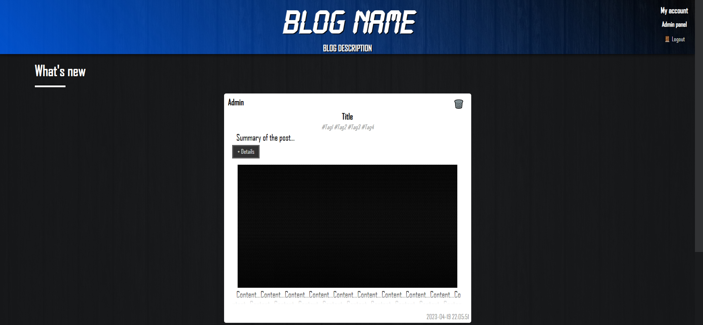

# NewBlog

## Summary

- [NewBlog](#newblog)
	- [Summary](#summary)
	- [Introduction](#introduction)
	- [Changelog](#changelog)
	- [Contributing to the project](#contributing-to-the-project)
	- [Contributors](#contributors)

## Introduction

NewBlog is a CMS (Content Managing system) written in PHP allowing you to post text/image content on your own blog.
It was written to learn PHP and web development in general.
The real interest of this project was to synthetize all the knowledge I had acquired in the past two years (2021-2022)
into a single project. It aims to include:

- Basic web languages (HTML, PHP, CSS, JS) with best practices
- SEO (indexation, meta tags, etc...)
- Responsive design
- Object Oriented Programming (encapsulation, inheritance, etc...)
- MVC web architecture
- Database management (procedures, views, triggers)
- Cybersecurity (prepared requests, password encryption, etc...) ⚠️ Needs penetration testing (2.0)
- Project management (Git versioning, UML, documentation, etc...)
- Testing (unit, functional, integration, performance etc...)
- Deployment & DevOps (Web server, DB server, CI/CD, Docker, etc...)

## Changelog

All notable changes to this project will be documented in the [CHANGELOG.md](CHANGELOG.md) file.

## Contributing to the project

Before starting, please read the [License](LICENSE) to understand the permissions and limitations of the project.
All information related to contributing to the project can be found in the [CONTRIBUTING.md](CONTRIBUTING.md) file. It is **mandatory** to read it before contributing to the project in order to follow the conventions and make the development process easier for everyone. Thank you for your understanding!  
Also check out the [DEV-CHANGELOG.md](DEV-CHANGELOG.md) file to see what's coming next!

## Contributors

- [Michael "Ace Anderson"](https://github.com/MichaelAceAnderson)
