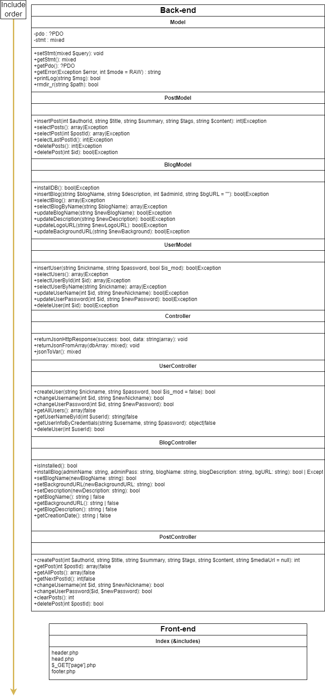
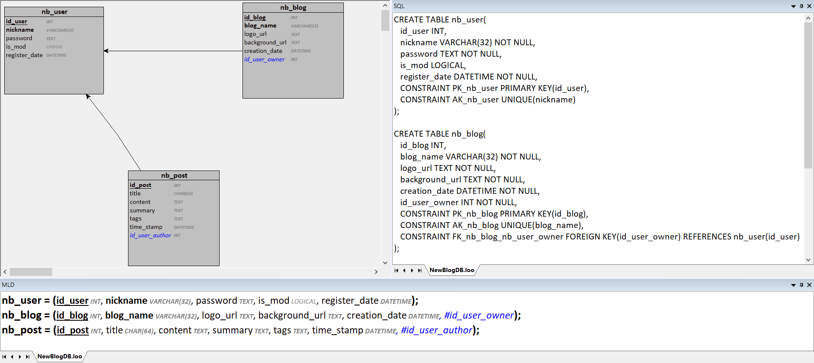

# NewBlog

Information for developers
NewBlog is a CMS (Content Managing system) written in PHP allowing you to post text/image content on your own blog.
It was written to learn PHP and web development in general.
The real interest of this project was to synthetize all the knowledge I had acquired in the past two years
into a single project. It is not yet finished but it aimes to use:

- Basic web languages (HTML, PHP, CSS, JS)
- SEO (indexation, meta tags, etc...)
- Responsive design
- Object Oriented Programming (encapsulation, inheritance, etc...)
- MVC web architecture
- Database management (procedures, views, triggers)
- Cybersecurity (prepared requests, password encryption, etc...) ⚠️ Needs penetration testing (2.0)
- Project management (Git versioning, UML, documentation, etc...)
- Testing (unit, functional, integration, performance etc...)
- Deployment & DevOps (Web server, DB server, CI/CD, Docker, etc...)

## Table of contents

- [NewBlog](#newblog)
  - [Table of contents](#table-of-contents)
  - [Getting started](#getting-started)
  - [To do (upcoming versions)](#to-do-upcoming-versions)
    - [Version 3.2 - Interaction update](#version-32---interaction-update)
    - [Version 3.1 - International update](#version-31---international-update)
    - [Version 3.0 - API update](#version-30---api-update)
    - [Version 2.1 - Developers update](#version-21---developers-update)
  - [Changelog](#changelog)
    - [Version 2.0 - Rewriting from scratch](#version-20---rewriting-from-scratch)
    - [Version 1.1 - MVC Update](#version-11---mvc-update)
    - [Version 1.0 - First release](#version-10---first-release)
  - [Documentation](#documentation)
    - [How a request is handled](#how-a-request-is-handled)
    - [How errors are handled](#how-errors-are-handled)
    - [How a page is structured](#how-a-page-is-structured)
    - [How the database is structured](#how-the-database-is-structured)
    - [How the app is structured](#how-the-app-is-structured)
      - [Model](#model)
      - [Controller](#controller)
      - [View](#view)
    - [Code conventions \& naming standards](#code-conventions--naming-standards)

## Getting started

Required:

- XAMPP (Apache/PHP) updated to the latest version
- PostGreSQL database up to date
- VSCode (or any other IDE)
- A web browser (NewBlog was only tested on Edge)

Step 1: Clone the repository (with the required rights)

```bash
git clone https://github.com/MichaelAceAnderson/NewBlog.git 
```

Step 2: Start the Apache server and the PostGreSQL database

Step 3: Make sure you have a "newblog" database with a "postgres" user and password "PG770rwx"

Step 4: Open the project in your IDE

Step 5: Open [the project](http://localhost/) in your browser

Step 6: Install the blog

Step 7: Use the account page (click on the username in the top right corner) to change credentials/post content

Step 8: Use the admin page to manage the blog settings

## To do (upcoming versions)

### Version 3.2 - Interaction update

 

- [ ] Add advanced post editor with markdown support (front/back)
- [ ] Add possibility to create multiple accounts on a same blog (front/back)
- [ ] Add comments system (front/back)

### Version 3.1 - International update

 

- [ ] Add language detection/selection system with constants & language files
- [ ] Convert code comments to English

### Version 3.0 - API update

 

- [ ] Add API for external applications
- [ ] Add JS live updates
- [ ] Add JS/PHP input validation (uploaded files types, e-mails RegEx, URLs etc...)

### Version 2.1 - Developers update

 

- [ ] Switch to Nginx & PHP-FPM (WinNMP ?) (back)
- [ ] HTTPS certificate (back)
- [ ] Make server compatible with Linux (back)
- [ ] Automatically separate environment between development and production (back)
- [ ] Dockerize application (back)
- [ ] Add Model Unit Tests (back)
- [ ] Add Controller Unit Tests (back)
- [ ] Cookie storage for session variables (back)
- [ ] Apply DICP principles to the code (back)
- [ ] Make theme colors & fonts user-customizable (front/back)
- [ ] Use Namespaces for PHP classes (back)
- [ ] Turn all static methods into custom object methods (back)
- [ ] Add inheritance for controllers and models (back)
- [ ] Separate SESSION variables into array (back)
- [ ] Create the database automatically and configure newblog db user in json/ini file (back)
- [ ] Add a "remember me" option for login (front/back)
- [ ] Try to make a model method for uploading files (back)
- [ ] Upload progress bar (front/back)
- [ ] Try to cache blog info to prevent useless DB requests (back)
- [ ] Add constants & global variables for re-used values \[ex: paths, links, ...\] (back)
- [ ] Make app portable by replacing absolute paths (DOCUMENT_ROOT) with relative paths (\_\_DIR\_\_) (back)
- [ ] Display missing file authorizations errors (back/front)
- [ ] Prevent access to development files with .htaccess (back)
- [ ] Replace .gitkeep by mkdir in PrintLog method (back)
- [ ] Add password confirmation in installation page (front/back)
- [ ] Add Update system to avoid reinstalling the blog (front/back)
- [ ] Add possibility to delete post if the user is the author (front/back)
- [ ] Add a table for tags and a table to link tags with posts (back)

## Changelog

### Version 2.0 - Rewriting from scratch

 

- [X] Refactorized to Model-View-Controller
- [X] Separated Model into entities
- [X] New design
- [X] Added Error logging
- [X] Added password hashing
- [X] Added page redirection (protection against direct access to files)
- [X] Added conception/UML diagrams

### Version 1.1 - MVC Update

 

- [x] Converted structure to Model-View-Controller
- [x] Fixed errors due to obsolete URLs
- [x] Various bug fixes

### Version 1.0 - First release

 
Features:

- [x] Text posts
- [x] Image posts
- [x] Admin panel
- [x] Choose logo
- [x] Choose background
- [x] Reset posts
- [x] Change blog title
- [x] Change blog description
- [x] Change login & password

## Documentation

### How a request is handled

Form (View) -> POST request -> GET request (Controller) -> Call Model method -> Return array/error (Model) -> Return array/false -> Display result/form Error/Success (View)

### How errors are handled

Model errors are logged in model.log (Model::printLog)
Controller errors are logged in controller.log (Controller::printLog)
View errors display form Errors generated by the controller

### How a page is structured



### How the database is structured



### How the app is structured

#### Model

model.php is only used to store generic functions related to PDO connection and error handling.

```php
class Model{
    /* PROPERTIES */ // (PDO connection, statement to use, etc...)
    /* METHODS */ // (accessors and error logging functions)

    // Include other models
}
```

Every other model is yet to become a child of the Model class and is used to store functions related to a specific table.

```php
class SpecificModel{
    /* METHODS */ // (return arrays or Exceptions)
}
```

#### Controller

controller.php is only used to store generic functions related to redirection and error displaying.

```php
class Controller{
    // Include model

    /* METHODS */ // (data conversion [HTTP/JSON] used for future API & logging)

    // Include other controllers
}
```

Every other controller is yet to become a child of the Controller class and is used to store functions handling requests between the view and a specific model.

```php
class SpecificController{
    /* METHODS */ // (return booleans adapted to the context or Exceptions on Model-related errors)
}
// Handle POST requests submitted by view forms and call the appropriate controller methods
```

#### View

index.php is the main page and handles every user interaction with the blog.
It includes the common structure and the content specific to the page requested (via GET)

```php
// Include head
// Include header
// Redirect user to the db_install page if the database is not installed (or corrupted)
// Redirect user to the install page if the blog is not installed (or corrupted)
// Redirect to 404 page if the page requested does not exist
// Include content (if not set, include home page)
// Include footer
```

### Code conventions & naming standards

```php
/* SECTION */ //(with caps)

/* Sub-section */ //(regular case)
// Fonction description // (regular case)
functionName(type: arg1, objectType|null: arg2) : returnType1 | returnType2 // (with camelCase)
{
    // if condition is true, meaning that [...]
    if(condition){
        // Do this action
        doThisAction();
    }
    else{
        // If condition is false, meaning that [...]
        // Do this other action
        doThisOtherAction('arg1', 'arg2'); // (/!\ with single quotes and escaped characters)
    }

    // execute this Function
    executeFunction();
}
```
